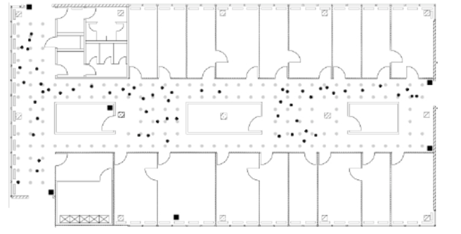

   
```{r,echo=FALSE,message=FALSE,warning=FALSE}

knitr::opts_chunk$set(fig.pos = "H", out.extra = "")
library(lattice)
library(dplyr)
library(ggplot2)
source('src/cs01_methods.R')
```
# Introduction

Real time location systems are used to locate objects and people in real time. For enterprises from different industries it is crucial to locate its assets which in turn helps increase in performance and improve services. Global positioning systems are most popular nowadays. One of the example from our daily lives is when we order food or cab online we can watch real time location of cab or delivery person and we can see estimated time of receive services at our end. Global positioning systems which uses satellite signals to track objects works only outdoor. They don't work inside buildings. 

With widespread use of Wireless technologies, we now have indoor positioning systems as well. These systems works very well and efficiently inside buildings. There are various ways of implementing Indoor positioning systems like Infrared systems, Proximity based systems, Acoustic System and WiFi based systems to name a few. Indoor positioning systems helps companies to track people and different assets in real time which they can use to improve productivity and services which in turn helps to increase profits.The purpose of such systems is to monitor movement of its people and assets in real-time, thereby reducing time spent in finding assets. The main idea of tracking things is to analyze productivity, improve services and increase efficiency which in turn helps in profits.


# Business Understanding

The business need that this work addresses is ability to locate objects and people on a given floor of a work or factory environment. This helps quantifying the efficiency of movement of assets, and can enable companies to put metrics around it that can be tracked year on year, leading to cost savings. E.g. in aerospace industry, where aircraft assembly can be a very complex process, wherein, deployment of this system could help uncover (a) bottlenecks in production line, (b) over all asset tracking and management, and (c) improve prediction in completion of assembly task.

This case study evaluates WiFi based Real time Location System for an organization. The dataset provided for this case study contains one million measurements of signal strength recorded at six different stationary access points (WiFi routers). These signal strengths are measured between handheld device such as cellular phone, laptops and all six access points. The goal of this study is to build a model using this dataset to detect the location of the device as a function of strength of the signal between handheld device and each access point and use this model to predict the location of the device based on the strength of the signal between device and each access points.

Layout of the building floorplan is depicted in Fig. 1


```{r, echo=FALSE,out.width="50%",out.height="50%",fig.cap="Building Floorplan",fig.align='center',fig.fullwidth=FALSE} 


```


As shown in the Fig.1 Six stationary access points are denoted by black square dots. Signal strength between handheld device and each access points was measured at 166 different locations with 8 different angles (0, 45,90,135 and so on) on this floor marked by grey dots. All grey dots are spaced one meter apart. Online measurements were recorded randomly selected points indicated with round black dots. 


There are numerous algorithms available to estimate location of the device from strength of the signal between device and each access point. This is classification problem and in this case study simple k-Nearest Neighbor (kNN) algorithm will be used as a classifier to build a model.  Since training dataset contains signal strength between device and access points at 166 different locations, Idea is for every new device on the floor with known signal strength find k nearest neighbors with similar signal strength at the known locations in training data by calculating **Euclidean distance** between two sets of signals as follows.

$$\sqrt{\sum_{i=1}^6(S_i* - S_i)^2}$$ 

Where,

$S_i$* = Single strength between  Access point and new device

$S_i$  = Single strength between Access point and specified position in the training data


## Objective

Build a model using offline data set to predict location of the devices in online dataset.

Two methods that shall be used for this case study are:

1.	kNN
2.	Weighted kNN


\newpage
# Data Evaluation / Engineering


In order to build Indoor Positioning System two datasets have been made available. 

   1. offline.final.trace.txt 
      
      This data will be used to train the model
      
   2. online.final.trace.txt
      
      This is test dataset. 

Both files are variable length files made up of following fields:

Field Name | Field Description|
-----------|-------------------|
t|timestamp in milliseconds since midnight, January 1, 1970 UTC|
id|MAC address of the scanning device|
pos|the physical coordinate of the scanning device|
degree|orientation of the user carrying the scanning device in degrees|
mac|MAC address of a responding peer (e.g., an access point or a device in adhoc mode) with the corresponding values for signal strength in dBm (Decibel-milliwatts), the channel frequency and its mode (access point = 3, device in adhoc mode = 1)|
signal|Signal Strength in DbM|

Both file are structured in specific format using more than on delimiters.Files contain fields related to scanning device and access points. Since data is not in tabular format some string manipulations has been performed on the dataset to convert it into tabular format.

Field mapping between text file and DataFrame as follows:

Field ID | Total DF Fields |New fields created in dataframe |
:---------|:-------:|:-----------------|
t | 1 |  time |
id | 1 | scanMac |
pos- These are comma separated fields x,y,z coordinates| 3| posX,posY,posZ |
degree | 1 | orientation |
MAC id of access point | 1| mac|
MAC is of access points are followed by three fields Signal strength,channel, access point type |3| signal,channel and type|

Struture and summary of dataframe after mapping all fields from input file is as follows:

**DataFrame Structure:**
```{r, echo=FALSE}
txt <- readLines("data/offline.final.trace.txt")
lines = txt[substr(txt, 1, 1) != "#"]
options(error = recover, warn = 1)
tmp = lapply(lines, processLine)
offline = as.data.frame(do.call("rbind", tmp),stringsAsFactors = FALSE)

names(offline) = c("time", "scanMac", "posX", "posY", "posZ",
                   "orientation", "mac", "signal",
                   "channel", "type")

numVars = c("time", "posX", "posY", "posZ",
            "orientation", "signal")
#factors = c("mac", "channel", "scanMac","type")

offline[numVars] = lapply(offline[numVars], as.numeric)

#offline[factors] = lapply(offline[factors], factor)
str(offline,vec.len=2)
```

**Dataframe Summary:**
```{r, echo=FALSE}
print(summary(offline))
```

Following changes were made based on analysis from Descriptive statistics :

* Removal of the Z position because it is all zeros based on summary statistics.
* Making scan angles consistent throughout the dataset.
* Remove extraneous access points which are related to adhoc device type and those with fewer observations.
* Remove rows for type=1 as they are not access points.
* Drop column scanMac as there is only on scanning device. Removing this column won't affect analysis. 


**Updated Structure of DataFrame:**

```{r,echo=FALSE} 
offline <- offline[offline$type == "3",]
offline$rawTime = offline$time
offline$time = offline$time/1000
class(offline$time) = c("POSIXt", "POSIXct")

offline$angle = roundOrientation(offline$orientation)
subMacs <- names(sort(table(offline$mac), decreasing = TRUE)) [1:7]
offline <- offline[offline$mac %in% subMacs,]
#offline$mac <- factor(offline$mac)

offline <- offline[,c("time","posX","posY","angle","mac","signal","rawTime","channel" )]
str(offline[1:6,c("time","posX","posY","angle","mac","signal","rawTime","channel" )],vec.len=2)
```
As we can see from above structure that mac now has only 7 levels. Which means that this dataset now removed all irrelevant data. But we have one extra accesspoint and we don't know which six are from the required floor of the building. Further analysis is required to confirm the same. Same is discussed in next section.

**Updated DataFrame:**

```{r,echo=FALSE}
#knitr::kable((offline[1:6,c("time","posX","posY","angle","mac","signal","rawTime" )]))
offline[1:6,c("time","posX","posY","angle","mac","signal","rawTime" )]
```

This processed dataset will now be used for further analysis to find relationship between variables.


\newpage
# Modeling Preparations

1.	Signal Strength 

Figure 2a) shows signal strength as measuring device weakens with distance from access point while Figure 2b) shows standard deviation increases with average strength of the signal. These visualizations are strong indication of signal strength related to distance from the access point.This feature is going to help in modeling.

```{r, echo=FALSE,out.width='.49\\linewidth', fig.width=7, fig.height=6,fig.show='hold',fig.align='left',fig.cap='Signal Strength'}
# create table of summary stats by Location, Angle and AP
offline$posXY = paste(offline$posX, offline$posY, sep = "-") # concat x,y
byLocAngleAP = with(offline, by(offline, list(posXY, angle, mac),  function(x) x))

# calculate summary statistics, reduce down to single summary line
signalSummary = 
  lapply(byLocAngleAP,            
         function(oneLoc) {
           ans = oneLoc[1, ]
           ans$medSignal = median(oneLoc$signal)
           ans$avgSignal = mean(oneLoc$signal)
           ans$num = length(oneLoc$signal)
           ans$sdSignal = sd(oneLoc$signal)
           ans$iqrSignal = IQR(oneLoc$signal)
           ans
           })
# bind all the summary lines together
offlineSummary = do.call("rbind", signalSummary)

# exclude mac at position 2: "00:0f:a3:39:dd:cd" per author's guidance
offlineSummary_orig = subset(offlineSummary, mac != subMacs[2])
#offlineSummary_orig$angle <- factor(as.factor(offlineSummary_orig$angle))
#offlineSummary_orig$mac <- factor(offlineSummary_orig$mac)
#offlineSummary_orig$channel <- factor(offlineSummary_orig$channel)
# create a mtrix with relevant positions for six access points on floor plan
AP = matrix(c( 7.5, 6.3, 2.5, -.8, 12.8, -2.8,  
                1, 14, 33.5, 9.3, 33.5, 2.8),
            ncol = 2, byrow = TRUE,
            dimnames = list(subMacs[-2], c("x", "y") ))

# relationship between signal stregnth and distance from AP
# distances from locations of the device emitting vs access point receiving

diffs = offlineSummary_orig[ , c("posX", "posY")] - AP[offlineSummary_orig$mac, ]
offlineSummary_orig$dist = sqrt(diffs[ , 1]^2 + diffs[ , 2]^2)

# simplified
xyplot(signal ~ dist | factor(substr(mac,10,17)), 
       data = offlineSummary_orig,
       main="2a) Signal Strength vs. Distance to Access Point",
       xlab ="distance"
       )

breaks = seq(-90, -30, by = 5)
bwplot(sdSignal ~ cut(avgSignal, breaks = breaks),
  data = offlineSummary,
  subset = mac != "00:0f:a3:39:dd:cd",
  main="2b) SD of Signal Strength by Mean Signal Strength",
  xlab = "Mean Signal", ylab = "SD Signal",scales=list(x=list(rot=45)))


```

2.	Wireless Access Points

Initial analysis found that dataset contains 21 MAC addresses with two types of measurements adhoc (type 1) and access points (type 3). We know from the building floorplan we need to consider 6 fixed access points for the analysis,there records belonging to adhoc measurements are removed. This reduces number of MAC addresses from 21 to 12. As per documentation there are 5 Linksys routers and 1 Lancom router is placed in the building. Upon further analysis it is found that 5 MAC addresses belongs to Linksys and none belongs to Lancom. So based on number of measurements top 7 MAC addresses are kept for analysis. Since we have one extra MAC address in the dataset we need to test model with below configuration to find 6th access point that results in better location predictions based on signal strength.

MAC Address | Scenario 1 (C0) | Scenario 2 (CD) | Scenario 3 (COCD)
------------|------------|------------|------------|
00:0f:a3:39:e1:c0|X||X
00:0f:a3:39:dd:cd| |X|X
00:14:bf:b1:97:8a|X|X|X
00:14:bf:3b:c7:c6|X|X|X
00:14:bf:b1:97:90|X|X|X
00:14:bf:b1:97:8d|X|X|X
00:14:bf:b1:97:81|X|X|X

\newpage
**Constraints:**

Access point locations are the same in training (offline) and test (online) dataset. If the locations change, then the signal strength – distance metric will change, and model has to be re-built.


```{r results, include=TRUE, echo=FALSE, cache=TRUE, warning=FALSE}
# identify dataset for training (exclude MAC per authors guidance)
# get minimum error and optimal K
offline_orig = offline[ offline$mac != "00:0f:a3:39:dd:cd", ]

result_names <- c("data/results_orig.RData","data/results_new.RData","data/results_combined.RData",
                  "data/results_wt.RData","data/results_wtn.RData","data/results_wtc.RData")

if (file.exists(result_names[1])) {
  load(file=result_names[1])
} else {
  results = cross_validate(offline_orig, offlineSummary_orig, K=20, wtd=FALSE)
  options(save.defaults=list(ascii=TRUE, safe=FALSE))
  save(results, file=result_names[1])
}
#print(paste('results of original',results))

offline_new = offline[ offline$mac != "00:0f:a3:39:e1:c0", ]
offlineSummary_new = offlineSummary[offlineSummary$mac != "00:0f:a3:39:e1:c0", ]

if (file.exists(result_names[2])) {
  load(file=result_names[2])
} else {
  results_new = cross_validate(offline_new, offlineSummary_new, K=20, wtd=FALSE)
  options(save.defaults=list(ascii=TRUE, safe=FALSE))
  save(results_new, file=result_names[2])
}
#print(paste('results of new',results_new))
if (file.exists(result_names[3])) {
  load(file=result_names[3])
} else {
  results_combined = cross_validate(offline, offlineSummary, K=20, wtd=FALSE)
  options(save.defaults=list(ascii=TRUE, safe=FALSE))
  save(results_combined, file=result_names[3])
}
#print(paste('results of combined',results_combined_wtd))

```

```{r, include=TRUE, echo=FALSE, cache=TRUE, warning=FALSE}
if (file.exists(result_names[4])) {
  load(file=result_names[4])
} else {
  results_wtd_orig = cross_validate(offline_orig, offlineSummary_orig, K=20, wtd=TRUE)
  options(save.defaults=list(ascii=TRUE, safe=FALSE))
  save(results_wtd_orig, file=result_names[4])
}
#print(paste('results of weighted', results_wtd_orig))
if (file.exists(result_names[5])) {
  load(file=result_names[5])
} else {
  results_wtd_new = cross_validate(offline_new, offlineSummary_new, K=20, wtd=TRUE)
  options(save.defaults=list(ascii=TRUE, safe=FALSE))
  save(results_wtd_new, file=result_names[5])
}
#print(paste('results of weighted', results_wtd_new))
if (file.exists(result_names[6])) {
  load(file=result_names[6])
} else {
  results_combined_wtd = cross_validate(offline, offlineSummary, K=20, wtd=TRUE)
  options(save.defaults=list(ascii=TRUE, safe=FALSE))
  save(results_combined_wtd, file=result_names[6])
}
#print(paste('results of combined',results_combined_wtd))

```


\newpage
# Modeling Scenarios (original Case)

To determine which MAC address to keep, the below analysis is performed. Based on the output we need to determine whether to keep MAC address ending in **"CD"** only, the MAC address ending in **"C0"** only, or keep both in our dataset. KNN methodology is executed on all three configurations and we will use the error rates output of the KNN below to determine the configuration to keep. For each configuration K is selected from 1 to 20 and we will use the graph and the table below to determine the best fit.

```{r, include=TRUE, cache=TRUE, echo=FALSE, warning=FALSE, fig.cap=cap,fig.width=6,fig.height=3,,fig.align='center',fig.fullwidth=FALSE}
ggplot()+
  geom_line(mapping=aes(x=seq(1,20,1), y=results[[3]],color="00:0f:a3:39:e1:c0"), linetype="dashed", show.legend = TRUE,size=1)+
  geom_point(mapping=aes(x=results[[2]], y=results[[1]]),color="green",size=2)+
  geom_line(mapping=aes(x=seq(1,20,1), y=results_new[[3]],color="00:0f:a3:39:dd:cd"), linetype="solid", show.legend = TRUE,size=1)+
  geom_point(mapping=aes(x=results_new[[2]], y=results_new[[1]]),color="red",size=2)+
  geom_line(mapping=aes(x=seq(1,20,1), y=results_combined[[3]],color="Combined"), linetype="dotdash", show.legend = TRUE,size=1)+
  geom_point(mapping=aes(x=results_combined[[2]], y=results_combined[[1]]), color="blue",size=2)+
  jtools::theme_apa()+
  theme(legend.position="top", legend.box = "horizontal")+
  labs(y="error", x="K")

cap <- "Simple Average KNN - Learning Curves for Each Scenario"
```

Based on the combined elbow plot above we can see that for Simple Average KNN **"CD"** and **"C0"** has the exact K=8. For the combined K=6 looks to be the optimal solution.


```{r, include=TRUE, echo=FALSE, cache=TRUE, fig.cap=cap,out.align='left'}
Access_Points <- c("C0","CD","C0CD")
Best_k <- c(results[[2]],results_new[[2]],results_combined[[2]])
Error_At_BestK <- c(results[[1]],results_new[[1]],results_combined[[1]])
df <- data.frame(Access_Points,Best_k,Error_At_BestK)

trainSS = reshapeSS_00(offlineSummary_orig, varSignal = "avgSignal")
knitr::kable(df,caption="Simple Average Summary",row.names = FALSE,col.names = c("Access Points","Best K","Error @ Best K"))
```


From the summary above the combination has the highest error. This would lead to not keeping both values in the mix. Given **"C0"** by itself has the lowest error this seems most likely option to address based on simple Average KNN analysis.


\newpage
# Modeling Scenario (extending Case)

Based on simple KNN we have determined that the dataset with **"C0"** only looks to be the best option. We will now perform a secondary analysis to verify the output from simple KNN using a weighted KNN. This methodology will allow for improved accuracy in predicting locations and the locations of closer distance may now have a larger impact to their neighbor groups then the once that are further away.
We will also leverage cross fold validation as part of this weighted KNN. For this analysis we will run 11 fold validation and keep the same K values from 1 to 20.

```{r, include=TRUE, cache=TRUE, echo=FALSE, warning=FALSE, fig.cap=cap,fig.width=6,fig.height=3,,fig.align='center',fig.fullwidth=FALSE}
ggplot()+
  geom_line(mapping=aes(x=seq(1,20,1), y=results_wtd_orig[[3]],color="00:0f:a3:39:e1:c0"), linetype="dashed", show.legend = TRUE,size=1)+
  geom_point(mapping=aes(x=results_wtd_orig[[2]], y=results_wtd_orig[[1]]),color="green",size=2)+
  geom_line(mapping=aes(x=seq(1,20,1), y=results_wtd_new[[3]],color="00:0f:a3:39:dd:cd"), linetype="solid", show.legend = TRUE,size=1)+
  geom_point(mapping=aes(x=results_wtd_new[[2]], y=results_wtd_new[[1]]),color="red",size=2)+
  geom_line(mapping=aes(x=seq(1,20,1), y=results_combined_wtd[[3]],color="Combined"), linetype="dotdash", show.legend = TRUE,size=1)+
  geom_point(mapping=aes(x=results_combined_wtd[[2]], y=results_combined_wtd[[1]]), color="blue",size=2)+
  jtools::theme_apa()+
  theme(legend.position="top", legend.box = "horizontal")+
  labs(y="error", x="K",color="Access Points")

cap <- "Weighted Average KNN - Learning Curves for Each Scenario"
```
The K values remained the same for both Weighted and Simple KNN. Now, when we look at the weighted error below we can see that **"CD"** is slightly better than the other scenarios presented.


```{r, include=TRUE, echo=FALSE, cache=TRUE, fig.cap=cap,fig.align='left'}
Access_Points <- c("C0","CD","C0CD")
Best_k <- c(results_wtd_orig[[2]],results_wtd_new[[2]],results_combined_wtd[[2]])
Error_At_BestK <- c(results_wtd_orig[[1]],results_wtd_new[[1]],results_combined_wtd[[1]])
df <- data.frame(Access_Points,Best_k,Error_At_BestK)
trainSS = reshapeSS_00(offlineSummary_orig, varSignal = "avgSignal")
knitr::kable(df,caption="Weighted Average Summary",row.names = FALSE,col.names = c("Access Points","Best K","Error @ Best K"))
cap <- "Weighted Average Summary"
```


**Best Scenario**

Isolating just **"CD"** and looking at the elbow plt below shows that K is indeed 8 and it seems to be the optimal number of neighbors for this KNN analysis.

```{r, include=TRUE, cache=TRUE, echo=FALSE, warning=FALSE, fig.cap=cap,fig.width=6,fig.height=3,,fig.align='center',fig.fullwidth=FALSE}
ggplot()+
  geom_line(mapping=aes(x=seq(1,20,1), y=results[[3]],color="Simple Avg"), linetype="dotdash", show.legend = TRUE,size=1)+
  geom_point(mapping=aes(x=results[[2]], y=results[[1]]),color="red",size=2)+
  geom_line(mapping=aes(x=seq(1,20,1), y=results_wtd_new[[3]],color="Weighted Avg"), linetype="solid", show.legend = TRUE,size=1)+
  geom_point(mapping=aes(x=results_wtd_new[[2]], y=results_wtd_new[[1]]), color="blue",size=2)+
  jtools::theme_apa()+
  theme(legend.position="top", legend.box = "horizontal")+
  labs(y="error", x="K",color="Access Points")

cap <- "Best Scenario - Simple Avg (C0)  Vs Weighted Avg KNN (CD)"
```


The difference between predicted location and test location can be visualized as shown below. This allows determining the proximity of points that are together.


```{r, include=TRUE, cache=TRUE, echo=FALSE, warning=FALSE, fig.cap=cap,fig.width=6,fig.height=3,fig.align='center'}
onlineSummary_orig = onlineSummary[, !(names(onlineSummary) %in% "00:0f:a3:39:e1:c0")]
#weight_ex <- predXYwtd_adj(onlineSummary_orig[1,6:11], onlineSummary[,4], offlineSummary_orig, numAngles = 3, k=8)

#results_wtd_orig = cross_validate(offline_orig, offlineSummary_orig, K=20, wtd=TRUE)
#print(paste('results of weighted', results_wtd_orig))

estXYk6wtd = predXYwtd_total(newSignals = onlineSummary_orig[ , 6:11], 
                       newAngles = onlineSummary_orig[ , 4], 
                       offlineSummary_orig, numAngles = 3, k = 8)

trainPoints = offlineSummary_orig[ offlineSummary_orig$angle == 0 & 
                                   offlineSummary_orig$mac == "00:0f:a3:39:dd:cd" ,
                                   c("posX", "posY")]

oldPar = par(mar = c(1, 1, 1, 1))

floorErrorMap(estXYk6wtd, onlineSummary_orig[ , c("posX","posY")], 
              trainPoints = trainPoints, AP = AP)

par(oldPar)
cap <- "Floor Level Errors Using Weighted KNN with 8 Neighbors"
```

\newpage
# Conclusion

Statistical indoor positioning system (IPS) for the test environment is developed using KNN algorithm. Three different access point combinations were analyzed, and the combination containing access point **00:0f:a3:39:e1:c0** provided best result as determined through minimum sum of squared error = **1030.984** for K = **8** using simple average method. 

To explore generating better model than simple average approach above, weighted KNN approach is adopted. In weighted KNN approach, weights are setup to be inverse of distance metric. This ensures higher weights are provided to neighboring points, rather than far away point. Intuitively, signal strength is expected to be better correlated in neighboring points than far away points. This is also evident from signal strength vs distance relation. The weighted KNN approach appears to leverage above fact, and provide even lower sum of squared error metric **999.84** (**00:0f:a3:39:dd:cd**) for K=**8**, than simple average approach for any access point combination & K value, as noted previously. 

One drawback of the approach is that it creates dependency on existing setup of WIFI access points. It is important that these are stationary, and their mac addresses are unique. Anytime a new WIFI router is installed, existing location is upgraded, or its location is changed, the repeat collection of offline training dataset needs to be undertaken, leading to overhead maintenance cost.

Alternative systems, e.g. use of Bluetooth beacons could also be considered for cost effectiveness, and improving accuracy of indoor positioning system.


# References

<div id="refs">
[1] Deborah Nolan; Duncan Temple Lang. Data Science in R.Chapman and Hall/CRC, 2015.

</div> 