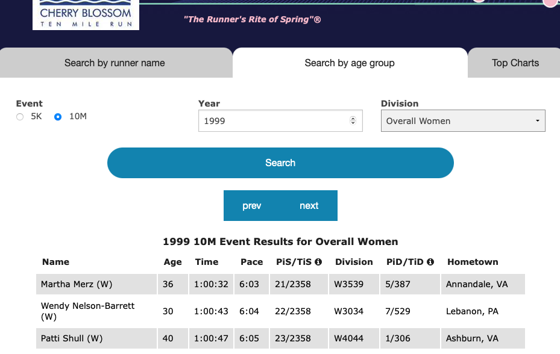

   
# Introduction

This is an information age and there is lot of data generated and published every day in different forms. If we just think about websites there are hundreds of thousands of websites across the world publish different types of content like research, news, education,blogs etc everyday and most of it is freely available to read and digest. Such information can be potentially be useful in gaining insights for personal and professional interests. e.g. we can learn lot about population like education, labor, gender distribution etc with exploring data from the census data published on world bank or census.gov. This is all available for free to download and view on such websites.

In this case study we are going to explore one of such website [www.cherryblossom.org](http://www.cherryblossom.org/). **Cherry blossom Ten Mile Run** is annual 10-mile road race in Washington, D.C. founded in 1973, almost 48 years ago and its popularity and participation in the event has grown over the years. As per their website in year 2018 around 17000 people participated in the race ranging in age 9 to 89 years. Textbook has covered Male racers in its example, we are going to explore Female racers. We will study how age affect physical performance in female racers and try to get many other insights hidden in the data.

_"According to Bureau for labor Statistics, road running is third most common form of sport and exercise activity among Americans."_ [2]

# Business Understanding

The purpose of the case study is to gather meaningful insights from women participant's results that are published on famous Cherry Blossom' website for the years 1999-2012 under 10 mile race category. The primary objective is to download the 1999 to 2012 results of 10 mile running event from the website to explore and shed light on the effect of age on the runner's physical performance over the years along with other meaningful insights if any. 

The Cherry Blossom organizes 5K and 10M running event year in Washington,D.C early in April when cherry trees are said to be in bloom. They record results for every participants and publish on their website. The race has been in such demand that the runner are chosen via lottery system to enter the race. Participants have different age range and for both male and female, however, this case study focuses on Woman's result.

## Objective

Download the woman's results for the duration of 1999-2012 from Cherry Blossom's website, perform data wrangling and gather meaningful insights.

\newpage
# Data Extraction / Preparation

At the time of writing this document [www.cherryblossom.org](http://www.cherryblossom.org/) was revamped and they have made results available in tabular format on  [http://www.cballtimeresults.org](http://www.cballtimeresults.org/performances). Based on new web page that they have designed it can list results based on option selected in the dropdowns and all results are paginated with one page shows 20 results. So result for selected year is spanned across multiple pages for selected year of result. There is no way data can be extracting manually. This has to be automated by method called Web scraping. The program will automatically scrape through pages and extract records for our analysis. 

The new Cherry blossom results pages are not dynamic content and it makes somewhat easier to pull all required records from the website. 

e.g URL for First page of 1999 Women's results for 10 Mile run:

http://www.cballtimeresults.org/performances?division=Overall+Women&page=1&section=10M&sex=W&utf8=&year=1999

```{r, echo=FALSE,out.width="100%",out.height="100%",fig.cap="Results Page",fig.align='center',fig.fullwidth=FALSE} 

```

URL pattern was observed same for all pages, records for all runners for selected years can be extracted just by changing values of  

* Page Number - _[page= ]_ 
* Race Year   - _[year= ]_ 

Following attributes remains same for our purpose as case study is limited to analysis of women racers.

* Division - _[division=Overall+Women]_ 
* Sex      - _[sex=W]_ 
* section  - _[section=10M]_ 

As seen in screenshot results are presented in tabular format. So web scraping is the method needs to be utilized to extract data from these results pages. R programming langauge comes with sophisticated technique to scrape through web pages to extract records from html tables. R package **rvest** provides interfaces which can accept URL and tags from which data to be extracted. Most of HTML parsing is done by rvest package but it does not format data to put in R dataframe. So additional programming is required to format data that is pulled from webpages. 

So to pull data from results web pages following things are required:

* Use rvest to parse HTML page with required tags. read_html, html_nodes, html_text are the supporting functions that will be used to extract tabular data.
* Regular expressions are also helpful sometimes to find specic pattern in strings. e.g. time column has specific format HH:MM:SS.Where HH, MM and SS are digits. Regular expressions are useful to check if time column contains data that contains other than colon and digits.
* Format records returned by **rvest** functions
* String manipulations are required to format data 
* Put data in R Data Frame and do further wrangling, once data was extracted. 

## Constraints 

Web scraping comes with limitations. Programs developed to pull data from the websites cannot be generalized much and it heavily dependent on design of the web pages. Although, no one changes web page design that  frequently, it is required for us to check if there are any changes in the web pages, structure of data etc to extract data from the website. Programs are needs to be updated if there is any change in the content on the web page. In general following things to needs to be taken into considerations when using web scraping to extract data

* URL - It may change. For cherry blossom results URL has similar format for all results. so we just have to change few parameters in the URL to retrieve required result. But that may not be the case always. URL may need to checked and program may need to be reconfigured.
* If data is in tabular format like in the case of Cherry Blossom website, they may add more columns or remove existing columns. So one has to keep checking on the structure of the data that they are scraping.
* Dynamic contents are even more challenging. In the case of dynamic content and URL to access is may not be that sophisticated as we found in Cherry Blossom website.
* Websites normally puts restrictions amount of to be extracted in single timeframe so large scale data extraction is harder.
* Robots.txt - This is very important. This file is used to manage traffic to the website. One should look at this file which is generally located at [http://www.abc.com/robots.txt](http://www.cherryblossom.org/robots.txt) to see if website allows web scraping/crawling. This is not the hard rule to follow what is written in the **robots.txt** but violation could lead to legal troubles.
* The targeted website can also block web crawler's IP address permanently if guidelines are not followed.
* R provides R package to extract data from website, but it does not support everything. There are many other tools available with R and Python that developers need to keep themselves updated instead of reiventing wheel.


\newpage
# Data Extraction / Execution


```{r,echo=FALSE,message=FALSE,warning=FALSE}
knitr::opts_chunk$set(fig.pos = "H", out.extra = "")
library(rvest)
library(lattice)
library(dplyr)
library(ggplot2)
#source('src/cs02_methods.R')
library(sqldf)
```


```{r, echo=FALSE,cache=TRUE }

cherry_blossom_ds <- read.csv('data/cherry_blossom01_2020.csv' ,sep=';',row.names=NULL,stringsAsFactors = FALSE,header = T,na.strings = c("NR"))
cherry_blossom_ds <- cherry_blossom_ds %>% filter(year < 2013)

```


```{r dataProcessing, echo=TRUE,message=TRUE, warning=FALSE}

cherry_blossom_ds$age <- as.numeric(cherry_blossom_ds$age)
cherry_blossom_ds$time <- as.character(cherry_blossom_ds$time)

yr_cnt <- count(cherry_blossom_ds,year)

tformat <- hms(cherry_blossom_ds$time)
cherry_blossom_ds$tmins <- hour(tformat)*60 + minute(tformat)  + second(tformat)/60

cherry_blossom_ds$ageRange = cut(cherry_blossom_ds$age,breaks = c(0,15,25,45,65,90))

age_yr_cnt <- (cherry_blossom_ds %>% group_by(ageRange) %>% count(year) %>% mutate(Nor = n/n[1])) %>% mutate(n_diff = n - lag(n))

cherry_blossom_ds$ageRange_gran = cut(cherry_blossom_ds$age,breaks = c(seq(0,90,10)))

age_gran_yr_cnt <- (cherry_blossom_ds %>% group_by(ageRange_gran) %>% count(year) %>% mutate(Nor = n/n[1])) %>% mutate(n_diff = n - lag(n))

age_yr_time <- (cherry_blossom_ds %>% group_by(ageRange_gran,year) %>% mutate(t_median = median(tmins)) %>% mutate(t_min = min(tmins)))

```


\newpage
# Business Analysis


```{r analysis19, fig.width = 12,echo=TRUE,message=TRUE, warning=FALSE}

ggplot(age_yr_time, aes(x = ageRange_gran, y = t_min, fill = as.factor(year)))+
  geom_bar(position = "dodge2", stat="identity",width = 1)+
  labs(title="Runtime \n Different Age Group by Year",x="Age Group", y = "Runtime, minutes")+
  scale_fill_discrete()+
  theme(plot.title = element_text(hjust = 0.5))
```

```{r analysis18, fig.width = 12,echo=TRUE,message=TRUE, warning=FALSE}

ggplot(age_yr_time)+
  geom_line(aes(x = year, y = t_min, color = ageRange_gran))+
  labs(title="Minimum runtime \n per Year by Age Group",x="Year", y = "Fastest Runtime, minutes")+
  scale_fill_discrete()+
  theme(plot.title = element_text(hjust = 0.5))
```

```{r analysis17, fig.width = 12,echo=TRUE,message=TRUE, warning=FALSE}

ggplot(age_yr_time)+
  geom_line(aes(x = year, y = t_median, color = ageRange_gran))+
  labs(title="Median runtime \n per Year by Age Group",x="Year", y = "Median Runtime, minutes")+
  scale_fill_discrete()+
  theme(plot.title = element_text(hjust = 0.5))
```

```{r analysis16, echo=TRUE,message=TRUE, warning=FALSE}

ggplot(na.omit(cherry_blossom_ds), aes(x = ageRange_gran, y = tmins))+
  geom_boxplot()+
  labs(title="Runtime Distribution by Age Group",x="Age Group", y = "Runtime, minutes")+
  theme_minimal()+
  theme(plot.title = element_text(hjust = 0.5))
```

```{r analysis15, echo=TRUE,message=TRUE, warning=FALSE}

ggplot(na.omit(cherry_blossom_ds), aes(x = ageRange, y = tmins))+
  geom_boxplot()+
  labs(title="Runtime Distribution by Age Group",x="Age Group", y = "Runtime, minutes")+
  theme_minimal()+
  theme(plot.title = element_text(hjust = 0.5))
```

```{r analysis14, echo=TRUE,message=TRUE, warning=FALSE}

ggplot(cherry_blossom_ds, aes(x = factor(year), y = tmins))+
  geom_boxplot()+
  labs(title="Runtime Distribution by Year",x="Year", y = "Runtime, minutes")+
  theme_minimal()+
  theme(plot.title = element_text(hjust = 0.5))
```


```{r analysis13, fig.width = 12,echo=TRUE,message=TRUE, warning=FALSE}

ggplot(age_yr_cnt, aes(x = ageRange, y = n_diff, fill = as.factor(year)))+
  geom_bar(position = "dodge2", stat="identity",width = 1)+
  labs(title="Women Participation Increase \n per Year by Age Group",x="Year", y = "Number of runners added, #")+
  scale_fill_discrete()+
  theme(plot.title = element_text(hjust = 0.5))
```


```{r analysis12, fig.width = 12,echo=TRUE,message=TRUE, warning=FALSE}

ggplot(age_gran_yr_cnt, aes(x = ageRange_gran, y = n_diff, fill = as.factor(year)))+
  geom_bar(position = "dodge2", stat="identity",width = 1)+
  labs(title="Women Participation Increase \n per Year by Age Group",x="Year", y = "Number of runners added, #")+
  scale_fill_discrete()+
  theme(plot.title = element_text(hjust = 0.5))
```

```{r analysis11, echo=TRUE,message=TRUE, warning=FALSE}

ggplot(age_yr_cnt[age_yr_cnt$ageRange == "(15,25]",], aes(x = ageRange, y = n_diff, fill = as.factor(year)))+
  geom_bar(position = "dodge2", stat="identity",width = 1)+
  labs(title="Women Participation Increase \n per Year 15-25 years Agegroup",x="Year", y = "#Women")+
  scale_fill_discrete()+
  theme(plot.title = element_text(hjust = 0.5))
```

```{r analysis10, echo=TRUE,message=TRUE, warning=FALSE}

ggplot(age_yr_cnt, aes(x = year, y = n))+
  geom_line(aes(color = ageRange))+
  labs(title="Women Participation Numbers \n by Age Group",x="Year", y = "Number of runners, #")+
  theme_minimal()+
  theme(plot.title = element_text(hjust = 0.5))
```

```{r analysis9, echo=TRUE,message=TRUE, warning=FALSE}

ggplot(age_gran_yr_cnt, aes(x = year, y = n))+
  geom_line(aes(color = ageRange_gran))+
  labs(title="Women Participation Numbers \n by Age Group",x="Year", y = "Number of runners, #")+
  theme_minimal()+
  theme(plot.title = element_text(hjust = 0.5))
```

```{r analysis8, echo=TRUE,message=TRUE, warning=FALSE}

ggplot(age_gran_yr_cnt, aes(x = year, y = Nor))+
  geom_line(aes(color = ageRange_gran))+
  labs(title="Relative Change in Women Participation Numbers \n by Age Group",x="Year", y = "Participation ratio (=n2012/n1999)")+
  theme_minimal()+
  theme(plot.title = element_text(hjust = 0.5))
```

```{r analysis7, echo=TRUE,message=TRUE, warning=FALSE}

ggplot(age_yr_cnt, aes(x = year, y = Nor))+
  geom_line(aes(color = ageRange))+
  labs(title="Relative Change in Women Participation Numbers \n by Age Group",x="Year", y = "Participation ratio (=n2012/n1999)")+
  theme_minimal()+
  theme(plot.title = element_text(hjust = 0.5))
```

```{r analysis6, echo=TRUE,message=TRUE, warning=FALSE}

ggplot(age_yr_cnt, aes(x = year, y = n))+
  geom_bar(stat="identity")+
  facet_wrap(~ageRange, ncol = 1)+
  labs(title="Women Participation by Year",x="Year", y = "Number of runners, #")+
  theme_minimal()+
  theme(plot.title = element_text(hjust = 0.5))
```

```{r analysis1, echo=TRUE,message=TRUE, warning=FALSE}


ggplot(yr_cnt, aes(x = year, y = n))+
  geom_bar(stat="identity")+
  labs(title="Women Participation by Year",x="Year", y = "Number of runners, #")+
  theme_minimal()+
  theme(plot.title = element_text(hjust = 0.5))
```

```{r analysis2, echo=TRUE,message=TRUE, warning=FALSE}

ggplot(cherry_blossom_ds, aes(x = factor(year), y = age))+
  geom_boxplot()+
  labs(title="Age Distribution by Year",x="Year", y = "Age")+
  theme_minimal()+
  theme(plot.title = element_text(hjust = 0.5))
```

```{r analysis3, echo=TRUE,message=TRUE, warning=FALSE}

ggplot(cherry_blossom_ds, aes(age))+
  geom_density(aes(fill=factor(year)), alpha=0.3) + 
  labs(title="Age Distribution by Year",x="Age", y = "Density")+
  theme_minimal()+
  theme(plot.title = element_text(hjust = 0.5))
```

```{r analysis4, echo=TRUE,message=TRUE, warning=FALSE}

ggplot(cherry_blossom_ds, aes(x=age, color = factor(year)))+
  geom_density() + 
  labs(title="Age Distribution by Year",x="Age", y = "Density")+
  theme_minimal()+
  theme(plot.title = element_text(hjust = 0.5))
```

```{r analysis5, echo=TRUE,message=TRUE, warning=FALSE}

ggplot(cherry_blossom_ds, aes(x=age, color = factor(year)))+
  geom_density() + 
  labs(title="Age Distribution by Year",x="Age", y = "Density")+
  theme_minimal()+
  theme(plot.title = element_text(hjust = 0.5))
```


```{r, echo=FALSE}
```


\newpage

# Conclusion


# References {-}

<div id="refs">
[1] Deborah Nolan; Duncan Temple Lang. Data Science in R.Chapman and Hall/CRC, 2015.
</div> 
<div id="refs">
[2] [Sports and exercise among Americans : The Economics Daily: U.S. Bureau of Labor Statistics](https://www.bls.gov/opub/ted/2016/sports-and-exercise-among-americans.htm)
</div> 
