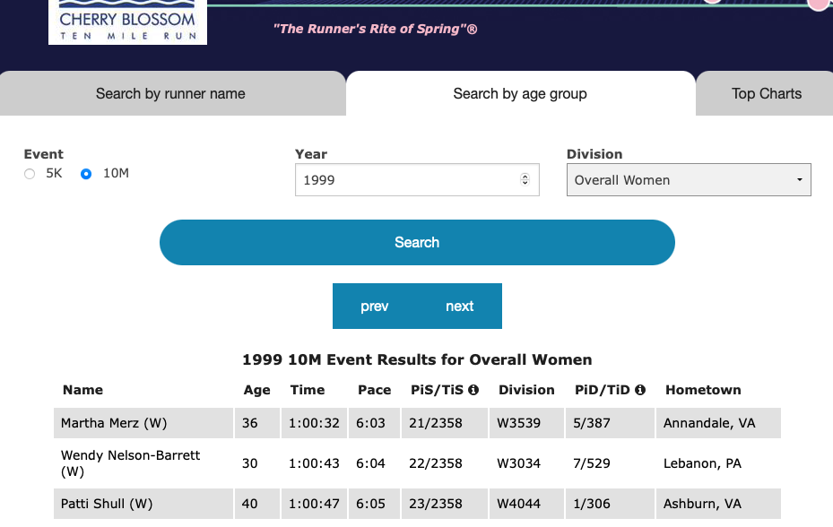

   
```{r,echo=FALSE,message=FALSE,warning=FALSE}
knitr::opts_chunk$set(fig.pos = "H", out.extra = "")
library(rvest)
library(lattice)
library(dplyr)
library(ggplot2)
source('src/cs02_methods.R')
library(sqldf)
library(pander)
library(visdat)
library(ggplot2)
theme_set(theme_bw())
```

```{r, echo=FALSE,cache=TRUE}
cb_raw_ds <- read.csv('data/cherry_blossom_2020.csv' ,
                       sep=';',row.names=NULL,
                       stringsAsFactors = FALSE,
                       header = T,na.strings = c("NR"))

cb_raw_ds <- cb_raw_ds %>% filter(year < 2013)

cb_processed_ds  <- read.csv('data/cherry_blossom01_2020.csv',
                              sep=';',row.names=NULL,
                              stringsAsFactors = FALSE,
                              header = T,na.strings = c("NR"))

cb_processed_ds <- cb_processed_ds %>% filter(year < 2013)

```


# Introduction

This is an information age and there is lot of data generated and published every day in different forms. If we just think about websites there are hundreds of thousands of websites across the world publish different types of content like research, news, education,blogs etc everyday and most of it is freely available to read and digest. Such information can be potentially be useful in gaining insights for personal and professional interests. e.g. we can learn lot about population like education, labor, gender distribution etc with exploring data from the census data published on world bank or census.gov. This is all available for free to download and view on such websites.

In this case study we are going to explore one of such website [www.cherryblossom.org](http://www.cherryblossom.org/). **Cherry blossom Ten Mile Run** is annual 10-mile road race in Washington, D.C. founded in 1973, almost 48 years ago and its popularity and participation in the event has grown over the years. As per their website in year 2018 around 17000 people participated in the race ranging in age 9 to 89 years. Textbook has covered Male racers in its example, we are going to explore Female racers. We will study how age affect physical performance in female racers and try to get many other insights hidden in the data.

_"According to Bureau for labor Statistics, road running is third most common form of sport and exercise activity among Americans."_ [2]

# Business Understanding

The purpose of the case study is to gather meaningful insights from women participant's results that are published on famous Cherry Blossom' website for the years 1999-2012 under 10 mile race category. The primary objective is to download the 1999 to 2012 results of 10 mile running event from the website to explore and shed light on the effect of age on the runner's physical performance over the years along with other meaningful insights if any. 

The Cherry Blossom organizes 5K and 10M running event year in Washington,D.C early in April when cherry trees are said to be in bloom. They record results for every participants and publish on their website. The race has been in such demand that the runner are chosen via lottery system to enter the race. Participants have different age range and for both male and female, however, this case study focuses on Woman's result.

Specifically we are trying answer following questions in this case study:

* Have age distributions changed over the years?
* Have race times increased or decreased over that range of time (in total and by age group)?
* What trends do you anticipate carrying forward into future years? (i.e., what important insight do you believe is worth sharing to race planners to help them think about the makeup of race runners in the future?)

## Objective

Download the woman's results for the duration of 1999-2012 from Cherry Blossom's website, perform data wrangling and gather meaningful insights.

\newpage
# Data Extraction / Preparation

At the time of writing this document [www.cherryblossom.org](http://www.cherryblossom.org/) was revamped and they have made results available in tabular format on  [http://www.cballtimeresults.org](http://www.cballtimeresults.org/performances). Based on new web page that they have designed it can list results based on option selected in the dropdowns and all results are paginated with one page shows 20 results. So result for selected year is spanned across multiple pages for selected year of result. There is no way data can be extracting manually. This has to be automated by method called Web scraping. The program will automatically scrape through pages and extract records for our analysis. 

The new Cherry blossom results pages are not dynamic content and it makes somewhat easier to pull all required records from the website. 

e.g URL for First page of 1999 Woman's results for 10 Mile run:

http://www.cballtimeresults.org/performances?division=Overall+Women&page=1&section=10M&sex=W&utf8=&year=1999

```{r, echo=FALSE,out.width="100%",out.height="100%",fig.cap="Results Page",fig.align='center',fig.fullwidth=FALSE} 

```

URL pattern was observed same for all pages, records for all runners for selected years can be extracted just by changing values of  

* Page Number - _[page= ]_ 
* Race Year   - _[year= ]_ 

Following attributes remains same for our purpose as case study is limited to analysis of women racers.

* Division - _[division=Overall+Women]_ 
* Sex      - _[sex=W]_ 
* section  - _[section=10M]_ 

As seen in screenshot results are presented in tabular format. So web scraping is the method needs to be utilized to extract data from these results pages. R programming langauge comes with sophisticated technique to scrape through web pages to extract records from html tables. R package **rvest** provides interfaces which can accept URL and tags from which data to be extracted. Most of HTML parsing is done by rvest package but it does not format data to put in R dataframe. So additional programming is required to format data that is pulled from webpages. 

So to pull data from results web pages following things are required:

* Use R rvest package to parse HTML page with required tags. read_html, html_nodes, html_text are the supporting functions that will be used to extract tabular data.
* Regular expressions are also helpful sometimes to find specic pattern in strings. e.g. time column has specific format HH:MM:SS.Where HH, MM and SS are digits. Regular expressions are useful to check if time column contains data that contains other than colon and digits.
* Format records returned by **rvest** functions
* String manipulations are required to format data 
* Put data in R Data Frame and do further wrangling, once data was extracted. 

## Constraints 

Web scraping comes with limitations. Programs developed to pull data from the websites cannot be generalized much and it heavily dependent on design of the web pages. Although, no one changes web page design that  frequently, it is required for us to check if there are any changes in the web pages, structure of data etc to extract data from the website. Programs are needs to be updated if there is any change in the content on the web page. In general following things to needs to be taken into considerations when using web scraping to extract data

* URL - It may change. For cherry blossom results URL has similar format for all results. so we just have to change few parameters in the URL to retrieve required result. But that may not be the case always. URL may need to checked and program may need to be reconfigured.
* If data is in tabular format like in the case of Cherry Blossom website, they may add more columns or remove existing columns. So one has to keep checking on the structure of the data that they are scraping.
* Dynamic contents are even more challenging. In the case of dynamic content and URL to access is may not be that sophisticated as we found in Cherry Blossom website.
* Websites normally puts restrictions amount of to be extracted in single timeframe so large scale data extraction is harder.
* Robots.txt - This is very important. This file is used to manage traffic to the website. One should look at this file which is generally located at [http://www.abc.com/robots.txt](http://www.cherryblossom.org/robots.txt) to see if website allows web scraping/crawling. This is not the hard rule to follow what is written in the **robots.txt** but violation could lead to legal troubles.
* The targeted website can also block web crawler's IP address permanently if guidelines are not followed.
* R provides R package to extract data from website, but it does not support everything. There are many other tools available with R and Python that developers need to keep themselves updated instead of reinventing the wheel.


\newpage
# Data Extraction / Execution

First step in extracting data from the website is crawl through different web pages by changing parameters in the URL as mentioned in previous section. Extract following fields for each runner, which in later steps can be restrcutred the desired format.
```{r, include=TRUE, echo=FALSE, cache=TRUE,out.align='left',fig.pos="top",results='markup'}
FieldName <- c("Year","Name","Age","Pace","PiSTiS","Division","PiDTiD","HomeTown")
FieldDesc <- c("Year of participation","Last Name and First Name of the Runner","Age","Miles per hour","Rank of the runner in Male/Female category","Division","Rank in Runner's Division","Runner's Home Town")
df <- data.frame(FieldName,FieldDesc)
knitr::kable(df,caption="Data Fields on the Website",row.names = FALSE,col.names = c("Field Name","Field Description") )
```
Data extracted from the wesbite loaded into R dataframe. R's rvest package was used to extract data from the HTML page on the Cherry Blossom website. All R methods are written in _cs02_methods.R_ file. Method _loadDF_ calls rvest functions _read_html_, _html_text_, regular expression along with custom made functions getURL, getPlayerRecord to read player's record to store into R dataframe. Values of the fields were loaded as it is from the HTML tables to R dataframe. First five records are as shown in below table.
```{r, include=TRUE, echo=FALSE, cache=TRUE,out.align='left',fig.pos="top",results='markup'}
knitr::kable(cb_raw_ds[1:5,-c(1,3,12)],caption="Runner's data parsed into dataframe",row.names = FALSE )
```
## Missing values

As we can see in above table shows there few NAs in the data.These are missing values. Fig 2 shows plot of missing values. It shows there are less than 20 records where Age,PiDTiD, Division is missing and around 70 records where hometown is missing.Missing Age is more of concern than hometown as Age is most crucial for our analysis. But missing values contributes only 0.025% in the required fields.

```{r, comment=NA,echo=FALSE,fig.align='center',fig.fullwidth=FALSE,fig.cap='Missing Values', fig.width=3, fig.height=2}
naniar::gg_miss_var(cb_raw_ds[,-c(1,3,12)],show_pct = TRUE)
```

## Impute or Drop Missing values

In R VIM package can be use to determine MCAR, MAR and MNAR conditions on missing data.[3][4]

```{r, comment=NA,echo=FALSE,out.width='.49\\linewidth', fig.width=7, fig.height=6,fig.show='hold',fig.align='left',fig.cap='Missing Values Actions',warning=FALSE}
VIM::marginplot(cb_processed_ds[,c(4,12)],main= "3a) Margin Plot")
#
# Replace NAs in Hometown with
#
cb_raw_ds <- cb_raw_ds[-c(which(is.na(cb_raw_ds$age))),-c(1,3,12)] 
cb_raw_ds[c(which(is.na(cb_raw_ds$Hometown))),]$Hometown <- "UNKNOWN"
#
# This player shares position with another player in women category and also in Division
# therefore replaced <-"961/1257"
#
cb_raw_ds[c(which(is.na(cb_raw_ds$PiDTiD))),]$PiDTiD <-"961/1257"
naniar::gg_miss_var(cb_raw_ds[-c(which(is.na(cb_raw_ds$age))),-c(1,3,12)],show_pct = TRUE)+labs(title= "3b) After handling Missing Values ")

```

Interpretation of the marginplot goes as follows:

* From the left vertical boxplots, blue is distribution of minutes when age is present
* Red boxplot distribution of minutes when age is not present.
* Age values are missing at 0.02% also from red and blue boxplot show these distributions are overlapping 
* Therefore missing values doesn't seem to violate MCAR assumptions.
* Values are Missing Completely at random and hence removing these values will not create any bias. 
* Imputation is not required therefore 19 observations have been removed.
* Missing Hometown values are replaced by "UNKNOWN" hometown.
* After removing rows with NA in age, only one value is NA in column PiDTiD, upon observation it was found that this player shares rank under women category and they both belong to same Division and apparently shares same rank in the divison as well. Therefore Rank in her division has hard-coded to "961/1257" where 961 is her rank and 1257 is total player in her division.
* Plot 3b) shows there is nothing missing in the data after handling all missing values.

## Preparing final dataset

Final dataset now contains following fields. Few variables are derived from the original and changed their datatypes as follows.    

e.g. PiDTiD is character string made up of Rank in Division and Total Runners in Division.
  
  e.g. 9/100 indicates runner's rank is 9 in his division and there are total 100 runners in his division. These values are split into two columns in the final dataset.
  
Table shows which are orignal fields and which are derived and from which it is derived.

```{r, include=TRUE, echo=FALSE, cache=TRUE,out.align='left',fig.pos="top",results='markup'}
FieldName <- c("Year","Name","Age","mins","PaceMins","rankWomens","TotalWomens",
               "Division","rankDivision","TotalDivisions","HomeTown","country")
DataType <- c("Integer","String","Integer","Float","Float","Integer","Integer",
               "String","Integer","Integer","String","String")

FieldType <- c("Original","Original","Original","Derived from time","Derived from Pace","Derived from PiSTiS","Derived from PiSTiS",
               "Original","Derived from PiDTiD","Derived from PiDTiD","Original","Derived from Hometown")
FieldDesc <- c("Year of participation","Last Name and First Name of the Runner","Age","Total Minutes","Miles per hour","Rank in woman's category","Total women particiapants",
               "Division","Rank in Runner's Division","Total Participants in Division ","Runner's Home Town","Runner's Home Country")
df <- data.frame(FieldName,FieldType,DataType,FieldDesc)
knitr::kable(df,caption="Final structure of dataframe",row.names = FALSE,col.names = c("Field Name","Original/Derived","Data Type","Field Description") )
```


**Structure of dataframe**

```{r, comment=NA,echo=FALSE,fig.align='center',fig.fullwidth=FALSE,fig.cap='Missing Values',fig.width=3,fig.height=2}
cb_processed_ds <- cb_processed_ds[-c(which(is.na(cb_processed_ds$age))),]
cb_processed_ds[c(which(is.na(cb_processed_ds$Hometown))),]$Hometown <- "UNKNOWN"
cb_processed_ds[c(which(is.na(cb_processed_ds$PiDTiD))),]$rankDivision <- "9"
cb_processed_ds[c(which(is.na(cb_processed_ds$PiDTiD))),]$TotalDivisions <- "1257"
cb_processed_ds[c(which(is.na(cb_processed_ds$PiDTiD))),]$PiDTiD <-"961/1257"
cb_final_ds <- cb_processed_ds[,c(1,3,4,12,13,15,16,8,17,18,10,14)]
cb_final_ds$rankDivision <- as.numeric(cb_final_ds$rankDivision)
```

```{r, comment=NA,echo=FALSE,fig.align='center',fig.fullwidth=FALSE,fig.cap='Missing Values',fig.width=3,fig.height=2}
str(cb_final_ds,vec.len=3)
```

## Summary of the data

```{r, comment=NA,echo=FALSE}
pandoc.table(summary(cb_final_ds), style='grid')
```

\newpage
## Exploratory Data Analysis 


### Age Distributions

```{r, include=TRUE, cache=TRUE, echo=FALSE, warning=FALSE, fig.cap=cap,fig.width=6,fig.height=3,fig.align='center',fig.fullwidth=FALSE}
g <- ggplot(cb_final_ds, aes(as.factor(year), age,fill=as.factor(year)))
g + geom_boxplot() + 
    labs(title="Age Distribution", 
         subtitle="1999-2012",
         caption="Source: Cherry Blossom",
         x="Year of Race",
       y="Age")+ theme(legend.position="none")
cap <- "Yearwise Age Distribution"
```

The Age Distribution chart from 1999-2012 shows over the course of time the average age has remained
relatively constant. 25-30 year olds make up majority of the race population and that’s consistent throughout
the years the races were held.

### Women Participation

```{r, echo=FALSE,out.width='.49\\linewidth', fig.width=7, fig.height=6,fig.show='hold',fig.align='left',fig.cap='Women Participation'}

df <- sqldf("select year,count(*) total_womens from cb_final_ds group by year order by year")
ggplot(df, aes(x=year, y=total_womens)) + 
  geom_bar(stat="identity", width=.5, fill="tomato3") + 
  labs(title="5a) Total Participation Count", 
       subtitle="1999-2012", 
       x="Year of Race",
       y="Total Womens Participated",
       caption="source: Cherry Blossom") + 
  theme(axis.text.x = element_text(angle=65, vjust=0.6))

yr_cnt  <- count(cb_final_ds,year)
tformat <- hms(cb_final_ds$time)
cb_final_ds$ageRange = cut(cb_final_ds$age,breaks = c(0,15,25,45,65,90))
age_yr_cnt <- (cb_final_ds %>% group_by(ageRange) %>% count(year) %>% mutate(Nor = n/n[1])) %>% mutate(n_diff = n - lag(n))
cb_final_ds$ageRange_gran = cut(cb_final_ds$age,breaks = c(seq(0,90,10)))
age_gran_yr_cnt <- (cb_final_ds %>% group_by(ageRange_gran) %>% count(year) %>% mutate(Nor = n/n[1])) %>% mutate(n_diff = n - lag(n))

ggplot(age_gran_yr_cnt, aes(x = year, y = n))+
  geom_line(aes(color = ageRange_gran),size=1.5)+
  labs(title="5b) Participation by Age Group",
       caption="Source: Cherry Blossom",
       x="Year of Race", y = "Womens Participants",color="Year")

```
\
\
5a) 

The participants count has steadily increased from ~2500 to about ~10000, i.e. 4X over 14 years. Refer Fig. Y. 2009 saw the biggest jump. Clearly this race’s popularity has grown over the years.

5b) 

Participation was up among all women age groups over the years. There’s a significant increase in women aged 20-30(4x) and also 30-40(3.5x) participation from 1999 to 2012.

### Runtime Distribution


```{r, comment=NA,include=TRUE, cache=TRUE, echo=FALSE, warning=FALSE,message=FALSE, fig.cap=cap,fig.width=6,fig.height=3,fig.align='center',fig.fullwidth=FALSE}
ggplot(cb_final_ds)+
geom_histogram(aes(x=mins)) + 
    labs(title="Overall Distribution", 
         subtitle="1999-2012",
         caption="Source: Cherry Blossom",
         x="Runtime, minutes",
         y="Count")
cap <- "Runtime Distribution"
```


Runtime, when considered over all the age groups, and overall the years, shows almost a normal distribution, with minor right skewness.


```{r, echo=FALSE,out.width='.49\\linewidth', fig.width=7, fig.height=6,fig.show='hold',fig.align='left',fig.cap='Runtime Distribution'}

ggplot(cb_final_ds, aes(x = ageRange_gran,y = mins,fill=as.factor(ageRange_gran)))+
   geom_boxplot() + 
   labs(title="7a) By Age Group", 
        subtitle="1999-2012",
         caption="Source: Cherry Blossom",
         x="Age Group",
         y="Runtime, minutes") + theme(legend.position="none")
 
ggplot(cb_final_ds, aes(x = factor(year), y = mins,fill=as.factor(year)))+
   geom_boxplot()+
   labs(title="7b) By Year",
        subtitle="1999-2012",x="Year", 
        caption="Source: Cherry Blossom",
        y = "Runtime, minutes") + theme(legend.position="none")

```
\
7a)

Looking at distributions over different age groups, it clearly shows the expected trend that median runtime is larger for larger age - group. It’s interesting that even the standard deviation of the Runtime is slightly increasing, 14.41 minutes to 20.34 minutes,  going from age group 40-50 to 70-80. This is indicative of larger variation in fitness levels of participants at higher age group. 80-90 year age group shows a drop-in variation, presumably due to most people participating having similar fitness level, and capability. This is not unexpected.

7b)

As far as yearly runtime distribution is concerned, There is minor variation in the distribution for all years. Mean Runtime over the year has not changed significantly.


### Longitudinal Analysis of Individual runners

```{r, echo=FALSE,out.width='.49\\linewidth', fig.width=7, fig.height=6,fig.show='hold',fig.align='left',fig.cap=cap}
all_years <- sqldf("select name,hometown,count(distinct year) played_cnt from cb_final_ds group by name,hometown order by count(distinct year) desc")
df <- sqldf("select cb.name,cb.year,cb.age,cb.mins from cb_final_ds cb, all_years ay where ay.name=cb.name and ay.hometown=cb.hometown and played_cnt>=13")

ggplot(df,aes(x=age, y=mins)) + 
geom_line(aes(colour=as.factor(name))) +
geom_point(size=0.1) + 
labs(title="8a) At least 13 Race Completed", 
     subtitle="1999-2012",
     caption="Source: Cherry Blossom",
     x="Age",
     y="Runtime, minutes") + theme(legend.position="none")

df <- sqldf("select cb.name,cb.year,cb.age,cb.mins from cb_final_ds cb, all_years ay where ay.name=cb.name and ay.hometown=cb.hometown and played_cnt>=10")

ggplot(df,aes(x=age, y=mins)) + 
geom_line(aes(colour=as.factor(name))) +
labs(title="8b) At least 10 Race Completed", 
     subtitle="1999-2012",
     caption="Source: Cherry Blossom",
     x="Age",
     y="Runtime, minutes") + theme(legend.position="none")

cap <- "Individual Runners"
```

The data obtained from the Cherry Blossom doesn't have any field to identify runner so these unique players were identified with name+hometown combination and they all appears to be common. Observations of above plots are as follows

8a)

Shows individual performances of women runners who have completed at least 13 races.There are total 9 runners found in the dataset.We can clearly see trend and performance of these 9 players over the years. As it can be seen in this plot most of the players started their competition in early forty years of age and performance of most of them are not consistent however, combined plot looks going upward which means that performances affected as age increases. i.e. time to finish race increases with age. There is only one player who started participating in the race in early 20s and improved her performance over the next 12 years. 

8b) 

Shows individual performances of women runners who have completed at least 10 races. There are total 70 runners in this category. Although its quite difficult to look at individual  performances, we can see overall trend is going upward indicating impact of age on runner's performance.


\newpage

# Business Analysis

## Change in age profiles 

```{r, comment=NA,include=TRUE, cache=TRUE, echo=FALSE, warning=FALSE,message=FALSE, fig.cap=cap,fig.width=4,fig.height=3,fig.align='center',fig.fullwidth=FALSE}

cb_final_ds %>% filter(year==1999 | year==2012) %>% 
            ggplot(aes(x=age, fill = factor(year)))+
            geom_density(alpha=0.4) + 
  labs(title="Age Distribution by Year",
      subtitle="1999-2012",
      caption="Source: Cherry Blossom",
       x="Age", y = "Density",fill='Year')

cap <- "Age Distribution change 1999 Vs 2012"
```
Looking at kernel density plots between 1999 and 2012, it is clear that there is shift towards younger age group.

```{r, comment=NA,include=TRUE, cache=TRUE, echo=FALSE, warning=FALSE,message=FALSE, fig.cap=cap,fig.width=5,fig.height=3,fig.align='center',fig.fullwidth=FALSE}
df <- cb_final_ds
df$ageRange_gran = cut(df$age,breaks = c(seq(0,90,10)))

yr_age_cnt <- (df %>% group_by(year) %>% count(ageRange_gran) %>% mutate(pPop = 100*n/sum(n)))

ggplot(yr_age_cnt, aes(x = year, y = pPop))+
  geom_line(aes(color = ageRange_gran))+
  labs(title="% Women Runners over the years \n by Age Group",
      subtitle="1999-2012",
      caption="Source: Cherry Blossom",
       x="Year", y = "% Runner population, #",colour="Age Group")

  cap <- "Women runner's yearwise by Age Group"

```
Above plot shows percentage of women runner across different age group for every year. It is clear that since 2003 age group 20-30 participation has increased significantly as compare to rest age group.In last two years even age group 30-40 has shown an uptick.
\
\
\
Summary:

**Above analysis clearly indicate that age profile of runners has changed over the years with more participation from younger runners in recent years.**

```{r, comment=NA,include=TRUE, cache=TRUE, echo=FALSE, warning=FALSE,message=FALSE, fig.cap=cap,fig.width=4,fig.height=3,fig.align='center',fig.fullwidth=FALSE}

yr_time <- (cb_final_ds %>% group_by(year) %>% mutate(t_median = median(mins)) %>% mutate(t_min = min(mins))  %>% mutate(t_max = max(mins)))

ggplot(yr_time)+
  geom_line(aes(x = year, y = t_max), color = "red")+
  geom_line(aes(x = year, y = t_min), color = "green")+
  geom_line(aes(x = year, y = t_median), color = "blue")+
  labs(title="Maximum runtime \n per Year by Age Group",
      subtitle="1999-2012",
      caption="Source: Cherry Blossom",
       x="Year", y = "Slowest Runtime, minutes")+
  scale_fill_discrete()+
  theme(plot.title = element_text(hjust = 0.5))

cap <- "Max. Runtime by Age Group"
```

Break up of race times by year, and reviewing median, fastest and slowest runtime provides insight on over all race time trend through the years. 
Race duration is expected to be set by slowest participant or maximum runtime of a participant in a race. This shows much larger fluctuation as compared to fastest or median runtime. The standard deviation for different time metrics over the years is captured in Table X.

Runtime Metric|Standard Deviation of Runtime over 14 years
--------------|-------------------------------------------------
Min (fastest participant)|1.22 minutes
Median (50th percentile)|1.89 minutes
Max (slowest participant)|10.18 minutes


```{r, comment=NA,include=TRUE, cache=TRUE, echo=FALSE, warning=FALSE,message=FALSE, fig.cap=cap,fig.width=5,fig.height=3,fig.align='center',fig.fullwidth=FALSE}

library(investr)

yr_time <- (cb_final_ds %>% group_by(year) %>% mutate(t_median = median(mins)) %>% mutate(t_min = min(mins))  %>% mutate(t_max = max(mins)))

lm.model <- lm(t_max ~ year, yr_time)

ggplot(yr_time, aes(x=year, y=t_max))+
    geom_point()+
    geom_smooth(method=lm, se=TRUE)+
    labs(title="Maximum runtime \n per Year by Age Group",
         subtitle="1999-2012",
         caption="Source: Cherry Blossom",
         x="Year", y = "Slowest Runtime, minutes")
   

cap <- "Maximum runtime across year"

print("Estimation with lower and upper calibration interval for maximum runtime = 150 minutes")
print(calibrate(lm.model, y0 = 150, interval = "inversion", level = 0.9))

```

Regression of maximum running time with the year shows negative small slope indicative of reduction and maximum runtime with year. However, as the plot below shows data is noisy and there is lot of variation around the mean. This leads to calibration interval to have very wide value from 1991-2038 for a race time of 150 mins at 90% significance , Here median estimate for the year is 2030. The data does not provide high confidence that race time is going to reduce in near future.

\newpage

# Conclusion

In conclusion the insights gathered from the Cherry Blossom race provides interesting trends and should be a cornerstone to planning the races in the future. 
In terms of runner's age age distribution, the average age has remained relatively constant.However, In recent years the percentage of 20–30 year-old joining the race has increased. And also formed maximum participant group across age groups.

To increase the participation even more for younger age group and to keep the momentum going organizers could consider including post race party for participants to eat drink ands socialize.With younger age group being more social media savvy, and looking for opportunities to tag and share their location and what they do, it may be a good idea to consider race locations in areas that provide more of such opportunities. 

In terms of runners age and completion times the trend again seems to be consistent over the years, even with significant increase in participation. There is minor variation in the distribution for all years. Mean and fastest runtime over the year has not changed significantly.Even the maximum participants runtime which should set overvall race duration does not provide clear trend if the race duration is reduced over the years.Hence, we need to continuously allocate same duration for the race time, as has been done so far. However, this metric should be tracked every year for additional data that may support any change in race time.  

Runtime, when considered over all the age groups, and overall, the years, shows almost a normal distribution, with minor right skewness.If the organizer can keep all the operations in check, we anticipate the participation to keep going up and results to stay consistent between the age group going into the future.

# References {-}


[1] Deborah Nolan; Duncan Temple Lang. Data Science in R.Chapman and Hall/CRC, 2015.

[2] [Sports and exercise among Americans : The Economics Daily: U.S. Bureau of Labor Statistics](https://www.bls.gov/opub/ted/2016/sports-and-exercise-among-americans.htm)

[3] Templ, Matthias & Alfons, Andreas & Filzmoser, Peter. (2012). Exploring incomplete data using visualization techniques. Advances in Data Analysis and Classification. 6. 29-47. 10.1007/s11634-011-0102-y.

[4] [Example of interpretation of VIM::marginplot](https://boostedml.com/2020/05/visualizing-missing-data-in-r-the-basics-with-vim.html#The_Margin_Plot_Checking_Missing_Completely_at_Random_MCAR)

</div>

 