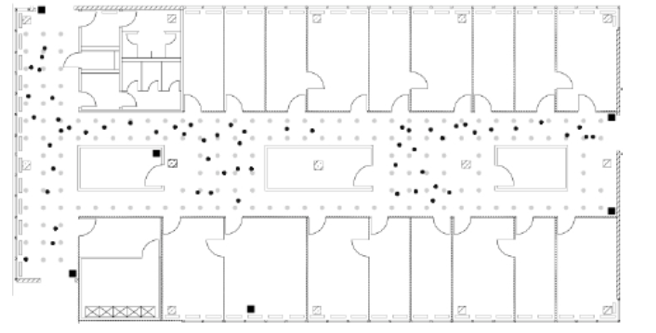

   
```{r,echo=FALSE,message=FALSE,warning=FALSE}

knitr::opts_chunk$set(fig.pos = "H", out.extra = "")
library(lattice)
library(dplyr)
```
# Introduction

Real time location systems are used to locate objects and people in real time. For enterprises from different industries it is crucial to locate its assets which in turn helps increase in performance and improve services. Global positioning systems are most popular nowadays. One of the example from our daily lives is when we order food or cab online we can watch real time location of cab or delivery person and we can see estimated time of receive services at our end. Global positioning systems which uses satellite signals to track objects works only outdoor. They don't work inside buildings. 

With widespread use of Wireless technologies, we now have indoor positioning systems as well. These systems works very well and efficiently inside buildings. There are various ways of implementing Indoor positioning systems like Infrared systems, Proximity based systems, Acoustic System and WiFi based systems to name a few. Indoor positioning systems helps companies to track people and different assets in real time which they can use to improve productivity and services which in turn helps to increase profits.The purpose of such systems is to monitor movement of its people and assets in real-time, thereby reducing time spent in finding assets. The main idea of tracking things is to analyze productivity, improve services and increase efficiency which in turn helps in profits.


# Business Understanding

This case study evaluates WiFi based Real time Location System for an organization. The dataset provided for this case study contains one million measurements of signal strength recorded at six different stationary access points (WiFi routers). These signal strengths are measured between handheld device such as cellular phone, laptops and all six access points. The goal of this study is to build a model using this dataset to detect the location of the device as a function of strength of the signal between handheld device and each access point and use this model to predict the location of the device based on the strength of the signal between device and each access points.

Layout of the building floorplan is depicted in Fig. 1


```{r, echo=FALSE,out.width="80%",out.height="60%",fig.cap="Building Floorplan",fig.align='center',fig.fullwidth=TRUE} 


```


As shown in the Fig.1 Six stationary access points are denoted by black square dots. Signal strength between handheld device and each access points was measured at 166 different locations with 8 different angles (0, 45,90,135 and so on) on this floor marked by grey dots. All grey dots are spaced one meter apart. Online measurements were recorded randomly selected points indicated with round black dots. 


There are numerous algorithms available to estimate location of the device from strength of the signal between device and each access point. This is classification problem and in this case study simple k-Nearest Neighbor (kNN) algorithm will be used as a classifier to build a model.  Since training dataset contains signal strength between device and access points at 166 different locations, Idea is for every new device on the floor with known signal strength find k nearest neighbors with similar signal strength at the known locations in training data by calculating **Euclidean distance** between two sets of signals as follows.

$$\sqrt{\sum_{i=1}^6(S_i* - S_i)^2}$$ 

Where,

$S_i$* = Single strength between  Access point and new device

$S_i$  = Single strength between Access point and speficied position in the training data


## Objective

Build a model using offline data set to predict location of the devices in online dataset.

Two methods that shall be used for this case study are:

1.	kNN
2.	Weighted kNN


\newpage
# Data Evaluation / Engineering


In order to build Indoor Positioning System two datasets have been made available. 

   1. offline.final.trace.txt 
      
      This data will be used to train the model
      
   2. online.final.trace.txt
      
      This is test dataset. 

Both files are variable length files made up of following fields:

Field Name | Field Description|
-----------|-------------------|
t|timestamp in milliseconds since midnight, January 1, 1970 UTC|
id|MAC address of the scanning device|
pos|the physical coordinate of the scanning device|
degree|orientation of the user carrying the scanning device in degrees|
mac|MAC address of a responding peer (e.g., an access point or a device in adhoc mode) with the corresponding values for signal strength in dBm (Decibel-milliwatts), the channel frequency and its mode (access point = 3, device in adhoc mode = 1)|
signal|Signal Strength in DbM|

Both file are structured in specific format using more than on delimiters.Files contain fields related to scanning device and access points. Since data is not in tabular format some string manipulations has been performed on the dataset to convert it into tabular format.

Field mapping between text file and DataFrame as follows:

Field ID | Total DF Fields |New fields created in dataframe |
:---------|:-------:|:-----------------|
t | 1 |  time |
id | 1 | scanMac |
pos- These are comma separated fields x,y,z coordinates| 3| posX,posY,posZ |
degree | 1 | orientation |
MAC id of access point | 1| mac|
MAC is of access points are followed by three fields Signal strength,channel, access point type |3| signal,channel and type|

Struture and summary of dataframe after mapping all fields from input file is as follows:

```{r, echo=FALSE}
processLine <- function(x)
{
  tokens = strsplit(x, "[;=,]")[[1]]
  if (length(tokens) == 10)
    return(NULL)
  tmp = matrix(tokens[- (1:10)], ncol = 4, byrow = TRUE)
  cbind(matrix(tokens[c(2, 4, 6:8, 10)], nrow(tmp), 6, byrow = TRUE), tmp)
}

roundOrientation = function(angles) {
 refs = seq(0, by = 45, length = 9)
 q = sapply(angles, function(o) which.min(abs(o - refs)))
 c(refs[1:8], 0)[q]
}

txt <- readLines("data/offline.final.trace.txt")
lines = txt[substr(txt, 1, 1) != "#"]
options(error = recover, warn = 1)
tmp = lapply(lines, processLine)
offline = as.data.frame(do.call("rbind", tmp),stringsAsFactors = FALSE)

names(offline) = c("time", "scanMac", "posX", "posY", "posZ",
                   "orientation", "mac", "signal",
                   "channel", "type")

numVars = c("time", "posX", "posY", "posZ",
            "orientation", "signal")
#factors = c("mac", "channel", "scanMac","type")

offline[numVars] = lapply(offline[numVars], as.numeric)

#offline[factors] = lapply(offline[factors], factor)
print(str(offline))
```

**Dataframe Summary:**
```{r, echo=FALSE}
print(summary(offline))
```

Following changes were made based on analysis from Descriptive statistics :

* Removal of the Z position because it is all zeros based on summary statistics.
* Making scan angles consistent throughout the dataset.
* Remove extraneous access points which are related to adhoc device type and those with fewer observations.
* Remove rows for type=1 as they are not access points.
* Drop column scanMac as there is only on scanning device. Removing this column won't affect analysis. 


Updated Structure of dataframe

```{r,echo=FALSE} 
offline <- offline[offline$type == "3",]
offline$rawTime = offline$time
offline$time = offline$time/1000
class(offline$time) = c("POSIXt", "POSIXct")

offline$angle = roundOrientation(offline$orientation)
subMacs <- names(sort(table(offline$mac), decreasing = TRUE)) [1:7]
offline <- offline[offline$mac %in% subMacs,]
#offline$mac <- factor(offline$mac)
readData <- function(x)
{

 txt <- readLines(x)
 lines = txt[substr(txt, 1, 1) != "#"]
 options(error = recover, warn = 1)
 tmp = lapply(lines, processLine)
 offline = as.data.frame(do.call("rbind", tmp),stringsAsFactors = FALSE)
 names(offline) = c("time", "scanMac", "posX", "posY", "posZ",
                    "orientation", "mac", "signal",
                    "channel", "type")

 numVars = c("time", "posX", "posY", "posZ",
            "orientation", "signal")
 #factors = c("mac", "channel", "scanMac","type")

 offline[numVars] = lapply(offline[numVars], as.numeric)

 #offline[factors] = lapply(offline[factors], factor) 

 offline = offline[offline$type == "3",]
 offline$rawTime = offline$time
 offline$time = offline$time/1000
 class(offline$time) = c("POSIXt", "POSIXct")
 offline$angle = roundOrientation(offline$orientation)
 
 subMacs <- names(sort(table(offline$mac), decreasing = TRUE)) [1:7]
 offline <- offline[offline$mac %in% subMacs,]
 #offline$mac <- factor(offline$mac)
 #locDF = with(offline, by(offline, list(posX, posY), function(x) x))
 #locDF = locDF[!sapply(locDF, is.null)]
 
 return(offline)
}
offline <- offline[,c("time","posX","posY","angle","mac","signal","rawTime","channel" )]
str(offline[1:6,c("time","posX","posY","angle","mac","signal","rawTime","channel" )])
```
As we can see from above structure that mac now has only 7 levels. Which means that this dataset now removed all irrelevant data. But we have one extra accesspoint and we don't know which six are from the required floor of the building. Further analysis is required to confirm the same. Same is discussed in next section.

Updated DataFrame

```{r,echo=FALSE}
#knitr::kable((offline[1:6,c("time","posX","posY","angle","mac","signal","rawTime" )]))
offline[1:6,c("time","posX","posY","angle","mac","signal","rawTime" )]
```

This processed dataset will now be used for further analysis to find relationship between variables.


\newpage
# Modeling Preparations

1.	Relationship between signal strength and distance

Signal strength at measuring device weakens with distance from Access Point. For the six access points in baseline analysis, the relationship is shown in Fig. 2


```{r, echo=FALSE,out.width='.49\\linewidth', fig.width=7, fig.height=6,fig.show='hold',fig.align='left',fig.cap='Signal Strength'}
# create table of summary stats by Location, Angle and AP
offline$posXY = paste(offline$posX, offline$posY, sep = "-") # concat x,y
byLocAngleAP = with(offline, by(offline, list(posXY, angle, mac),  function(x) x))

# calculate summary statistics, reduce down to single summary line
signalSummary = 
  lapply(byLocAngleAP,            
         function(oneLoc) {
           ans = oneLoc[1, ]
           ans$medSignal = median(oneLoc$signal)
           ans$avgSignal = mean(oneLoc$signal)
           ans$num = length(oneLoc$signal)
           ans$sdSignal = sd(oneLoc$signal)
           ans$iqrSignal = IQR(oneLoc$signal)
           ans
           })
# bind all the summary lines together
offlineSummary = do.call("rbind", signalSummary)

# exclude mac at position 2: "00:0f:a3:39:dd:cd" per author's guidance
offlineSummary_orig = subset(offlineSummary, mac != subMacs[2])
#offlineSummary_orig$angle <- factor(as.factor(offlineSummary_orig$angle))
#offlineSummary_orig$mac <- factor(offlineSummary_orig$mac)
#offlineSummary_orig$channel <- factor(offlineSummary_orig$channel)
# create a mtrix with relevant positions for six access points on floor plan
AP = matrix(c( 7.5, 6.3, 2.5, -.8, 12.8, -2.8,  
                1, 14, 33.5, 9.3, 33.5, 2.8),
            ncol = 2, byrow = TRUE,
            dimnames = list(subMacs[-2], c("x", "y") ))

# relationship between signal stregnth and distance from AP
# distances from locations of the device emitting vs access point receiving

diffs = offlineSummary_orig[ , c("posX", "posY")] - AP[offlineSummary_orig$mac, ]
offlineSummary_orig$dist = sqrt(diffs[ , 1]^2 + diffs[ , 2]^2)

# simplified
xyplot(signal ~ dist | factor(substr(mac,10,17)), 
       data = offlineSummary_orig,
       main="Signal Strength vs. Distance to Access Point",
       xlab ="distance"
       )

breaks = seq(-90, -30, by = 5)
bwplot(sdSignal ~ cut(avgSignal, breaks = breaks),
  data = offlineSummary,
  subset = mac != "00:0f:a3:39:dd:cd",
  main="SD of Signal Strength by Mean Signal Strength",
  xlab = "Mean Signal", ylab = "SD Signal",scales=list(x=list(rot=45)))


```

```{r,echo=FALSE,fig.cap="Distribution of Signal by Angle for Each Access Point"}


```
2.	Wireless access points are fixed

Access point locations are the same in training (offline) and test (online) dataset. If the locations change, then the signal strength – distance metric will change, and model has to be re-built.


# Modeling Scenarios (original Case)
```{r knn_training_example, include=TRUE, echo=FALSE, cache=TRUE, fig.cap="Aggregate Data for Analysis"}
# this is the original reshape function
reshapeSS = function(data, varSignal = "signal", 
                     keepVars = c("posXY", "posX","posY")) {
  byLocation =
    with(data, by(data, list(posXY), 
                  function(x) {
                    ans = x[1, keepVars]
                    avgSS = tapply(x[ , varSignal ], x$mac, mean)
                    y = matrix(avgSS, nrow = 1, ncol = 6,
                               dimnames = list(ans$posXY,
                                               names(avgSS)))
                    cbind(ans, y)
                  }))

  newDataSS = do.call("rbind", byLocation)
  return(newDataSS)
}

# build all of this into a funciton
trainSS = reshapeSS(offlineSummary_orig, varSignal = "avgSignal")
knitr::kable(trainSS[1:5,1:6], caption="Table 2: Formatted Dataset for KNN Use", row.names = FALSE)
cap <- "Table 2: Aggregate Data for Analysis"
```


```{r surface_compare, include=TRUE, echo=FALSE, cache=TRUE, fig.cap=cap}

compareMacList <- c("00:0f:a3:39:dd:cd", "00:0f:a3:39:e1:c0")

surfaceSS = function(data, mac, angle = 45) {
  require(fields)
  oneAPAngle = data[ data$mac == mac & data$angle == angle, ]
  smoothSS = Tps(oneAPAngle[, c("posX","posY")], 
                 oneAPAngle$avgSignal)
  vizSmooth = predictSurface(smoothSS)
  plot.surface(vizSmooth, type = "C", 
               xlab = mac, ylab = "", xaxt = "n", yaxt = "n")
  points(oneAPAngle$posX, oneAPAngle$posY, pch=19, cex = 0.5) 
}

parCur = par(mfrow = c(2,2), mar = rep(1, 4)) 

mapply(surfaceSS, 
       mac = compareMacList[rep(c(1,2), each=2)], 
       angle = rep(c(90, 135), 2), 
       data = list(data = offlineSummary))

par(parCur)
cap <- "Figure 2: Signal Strength for Two Similar Access Points"
```

```{r define_funcs, include=TRUE, echo=FALSE, cache=TRUE}
# define critical prediction and CV functions for analysis purposes

# reshape signal strength, ensure we use if (sampleAngle) for CV purposes
reshapeSS = function(data, varSignal = "signal", 
                     keepVars = c("posXY", "posX","posY"),
                     sampleAngle = FALSE, 
                     refs = seq(0, 315, by = 45)) {
  byLocation =
    with(data, by(data, list(posXY), 
                  function(x) {
                    if (sampleAngle) {
                      x = x[x$angle == sample(refs, size = 1), ]}
                    ans = x[1, keepVars]
                    avgSS = tapply(x[ , varSignal ], x$mac, mean)
                    y = matrix(avgSS, nrow = 1, ncol = 6,
                               dimnames = list(ans$posXY,
                                               names(avgSS)))
                    cbind(ans, y)
                  }))

  newDataSS = do.call("rbind", byLocation)
  return(newDataSS)
}
```

# get training data for each new obs (including angle logic)
```{r define_funcs, include=TRUE, echo=FALSE, cache=TRUE}
selectTrain = function(angleNewObs, signals = NULL, m = 1){
  refs = seq(0, by = 45, length  = 8)
  nearestAngle = roundOrientation(angleNewObs)
  
  if (m %% 2 == 1) 
    angles = seq(-45 * (m - 1) /2, 45 * (m - 1) /2, length = m)
  else {
    m = m + 1
    angles = seq(-45 * (m - 1) /2, 45 * (m - 1) /2, length = m)
    if (sign(angleNewObs - nearestAngle) > -1) 
      angles = angles[ -1 ]
    else 
      angles = angles[ -m ]
  }
  angles = angles + nearestAngle
  angles[angles < 0] = angles[ angles < 0 ] + 360
  angles[angles > 360] = angles[ angles > 360 ] - 360
  angles = sort(angles) 
  
  offlineSubset = signals[ signals$angle %in% angles, ]
  reshapeSS(offlineSubset, varSignal = "avgSignal")
}
```

```{r define_funcs, include=TRUE, echo=FALSE, cache=TRUE}
# KNN: FIND NEIGHBORS - AVG BASED
findNN = function(newSignal, trainSubset) {
  diffs = apply(trainSubset[ , 4:9], 1, 
                function(x) x - newSignal) # this inverts, places x,y on cols when called as.numeric
  dists = apply(diffs, 2, function(x) sqrt(sum(x^2)) ) # this gets our distance (euclidean)
  closest = order(dists) # orders our distances in ascending
  return(trainSubset[closest, 1:3 ]) # returns the subset from training with closest distances, gives xy ID, x, y
}
```

# PREDXY: takes an input of newSignals, their angles, and returns the estimated positions
```{r define_funcs, include=TRUE, echo=FALSE, cache=TRUE}
predXY = function(newSignals, newAngles, trainData, 
                  numAngles = 1, k = 3){
  
  closeXY = list(length = nrow(newSignals))
  
  for (i in 1:nrow(newSignals)) {
    trainSS = selectTrain(newAngles[i], trainData, m = numAngles)
    closeXY[[i]] = findNN(newSignal = as.numeric(newSignals[i, ]),
                           trainSS)
  }

  estXY = lapply(closeXY, function(x)
                            sapply(x[ , 2:3], 
                                    function(x) mean(x[1:k])))
  estXY = do.call("rbind", estXY)
  return(estXY)
}
```

# ERROR CALCULATION
```{r define_funcs, include=TRUE, echo=FALSE, cache=TRUE}
calcError = 
function(estXY, actualXY) 
   sum( rowSums( (estXY - actualXY)^2) )
```

# WKNN: WEIGHTED K NEIGHBORS
```{r define_funcs, include=TRUE, echo=FALSE, cache=TRUE}
findWtdNN = function(newSignal, trainSubset) {
  diffs = apply(trainSubset[ , 4:9], 1, 
                function(x) x - newSignal) 
  dists = apply(diffs, 2, function(x) sqrt(sum(x^2)) ) 
  closest = order(dists) # orders distances ascending
  closeXY = trainSubset[closest, 1:3 ]
  weight = as.numeric(1/dists[closest]) 
  return(cbind(closeXY, weight)) 
}
```

# pull cross validation process into a repeatable function
```{r define_funcs, include=TRUE, echo=FALSE, cache=TRUE}
cross_validate = function(train_full, train_summary, K=20, folds=11, 
                          keepVars = c("posXY", "posX","posY", "angle"),
                          wtd=FALSE) {
set.seed(25)
permuteLocs = sample(unique(train_summary$posXY))
permuteLocs = matrix(permuteLocs, ncol = folds, 
                     nrow = floor(length(permuteLocs)/folds))

onlineCVSummary = reshapeSS(train_full, keepVars = keepVars, sampleAngle = TRUE)

err = rep(0, K)

for (j in 1:folds) {
  onlineFold  = subset(onlineCVSummary,  posXY %in% permuteLocs[ , j])
  offlineFold = subset(train_summary, posXY %in% permuteLocs[ , -j])
  actualFold = onlineFold[ , c("posX", "posY")]
  
    for (k in 1:K) {
      if(wtd == TRUE){
                       estFold = predXYwtd(newSignals = onlineFold[ , 5:10],
                                 newAngles = onlineFold[ , 4], 
                                 offlineFold, numAngles = 3, k = k)
                       err[k] = err[k] + calcError(estFold, actualFold)
      
                     } else {
                       estFold = predXY(newSignals = onlineFold[ , 5:10],
                                        newAngles = onlineFold[ , 4], 
                                        offlineFold, numAngles = 3, k = k)
                       err[k] = err[k] + calcError(estFold, actualFold)
                     }
                    }
                   }

rmseMin = min(err)
kMin = which(err == rmseMin)[1]

return(list(rmseMin, kMin, err))
}

```

```{r cross_validation_orig, include=FALSE, echo=FALSE, cache=TRUE, warning=FALSE}
# identify dataset for training (exclude MAC per authors guidance)
# get minimum error and optimal K
offline_orig = offline[ offline$mac != "00:0f:a3:39:dd:cd", ]

file_name <- "data/results.RData"

if (file.exists(file_name)) {
  results = cross_validate(offline_orig, offlineSummary_orig, K=20, wtd=FALSE)
  options(save.defaults=list(ascii=TRUE, safe=FALSE))
  save(results, file=file_name)
} else {
  results <- load(file_name)
}

print(paste('results of original',results))
```

# Modeling Scenario (extending Case)


# Conclusions


# References

<div id="refs">
[1] Deborah Nolan; Duncan Temple Lang. Data Science in R.Chapman and Hall/CRC, 2015.

</div> 